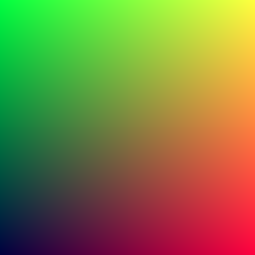

# 3. Vectors and Color

In this chapter, we are given the definitions of several C++ classes and utility functions to deal with 3D vectors and colors.  Since Idris includes support for vectors (and matrices, through the `contrib` package, as we saw in chapter 2), we'll use those instead of creating our own.  We'll also create a **type synonym** to represent color and update our existing code to use these new definitions.

## 3.1 Variables and Methods

### Listing 4: `vec3` class

```cpp
#ifndef VEC3_H
#define VEC3_H

#include <cmath>
#include <iostream>

using std::sqrt;

class vec3 {
    public:
        vec3() : e{0,0,0} {}
        vec3(double e0, double e1, double e2) : e{e0, e1, e2} {}

        double x() const { return e[0]; }
        double y() const { return e[1]; }
        double z() const { return e[2]; }

        vec3 operator-() const { return vec3(-e[0], -e[1], -e[2]); }
        double operator[](int i) const { return e[i]; }
        double& operator[](int i) { return e[i]; }

        vec3& operator+=(const vec3 &v) {
            e[0] += v.e[0];
            e[1] += v.e[1];
            e[2] += v.e[2];
            return *this;
        }

        vec3& operator*=(const double t) {
            e[0] *= t;
            e[1] *= t;
            e[2] *= t;
            return *this;
        }

        vec3& operator/=(const double t) {
            return *this *= 1/t;
        }

        double length() const {
            return sqrt(length_squared());
        }

        double length_squared() const {
            return e[0]*e[0] + e[1]*e[1] + e[2]*e[2];
        }

    public:
        double e[3];
};

// Type aliases for vec3
using point3 = vec3;   // 3D point
using color = vec3;    // RGB color

#endif
```

Create a new file, `Vec3.idr`, with the following definitions:

```idris
module Vec3

import public Data.Vect

%access public export

{- Types -}
Vec3 : Type
Vec3 = Vect 3 Double

Point3 : Type
Point3 = Vec3

{- Accessors -}
xIdx : Fin 3
xIdx = restrict 2 0

yIdx : Fin 3
yIdx = restrict 2 1

zIdx : Fin 3
zIdx = restrict 2 2

getX : Vec3 -> Double
getX = index xIdx

getY : Vec3 -> Double
getY = index yIdx

getZ : Vec3 -> Double
getZ = index zIdx
```

## 3.2 `vec3` Utility Functions

### Listing 5: `vec3` utility functions

```cpp
// vec3 Utility Functions

inline std::ostream& operator<<(std::ostream &out, const vec3 &v) {
    return out << v.e[0] << ' ' << v.e[1] << ' ' << v.e[2];
}

inline vec3 operator+(const vec3 &u, const vec3 &v) {
    return vec3(u.e[0] + v.e[0], u.e[1] + v.e[1], u.e[2] + v.e[2]);
}

inline vec3 operator-(const vec3 &u, const vec3 &v) {
    return vec3(u.e[0] - v.e[0], u.e[1] - v.e[1], u.e[2] - v.e[2]);
}

inline vec3 operator*(const vec3 &u, const vec3 &v) {
    return vec3(u.e[0] * v.e[0], u.e[1] * v.e[1], u.e[2] * v.e[2]);
}

inline vec3 operator*(double t, const vec3 &v) {
    return vec3(t*v.e[0], t*v.e[1], t*v.e[2]);
}

inline vec3 operator*(const vec3 &v, double t) {
    return t * v;
}

inline vec3 operator/(vec3 v, double t) {
    return (1/t) * v;
}

inline double dot(const vec3 &u, const vec3 &v) {
    return u.e[0] * v.e[0]
         + u.e[1] * v.e[1]
         + u.e[2] * v.e[2];
}

inline vec3 cross(const vec3 &u, const vec3 &v) {
    return vec3(u.e[1] * v.e[2] - u.e[2] * v.e[1],
                u.e[2] * v.e[0] - u.e[0] * v.e[2],
                u.e[0] * v.e[1] - u.e[1] * v.e[0]);
}

inline vec3 unit_vector(vec3 v) {
    return v / v.length();
}
```

Since we have access to numerical function in the `contrib` package, we can avoid having to implement most of these ourselves.  

Add the following import to `Vec3.idr`:

```idris
import public Data.Matrix.Numeric
```

We do need to implement a few of the functions, however.  Update `Vec3.idr` with the following additional definitions:

```idris
{- Functions -}
dot : Vec3 -> Vec3 -> Double
dot a b = sum $ zipWith (*) a b

lenSq : Vec3 -> Double
lenSq v = dot v v

len : Vec3 -> Double
len = (sqrt . lenSq)

unitVector : Vec3 -> Vec3
unitVector v =
  let
    l : Double = len v
  in
    if l == 0.0 then v else map (/ l) v
```

## Color Utility Functions

### Listing 6: color utility functions

```cpp
#ifndef COLOR_H
#define COLOR_H

#include "vec3.h"

#include <iostream>

void write_color(std::ostream &out, color pixel_color) {
    // Write the translated [0,255] value of each color component.
    out << static_cast<int>(255.999 * pixel_color.x()) << ' '
        << static_cast<int>(255.999 * pixel_color.y()) << ' '
        << static_cast<int>(255.999 * pixel_color.z()) << '\n';
}

#endif
```

We're going to approach things slightly differently.  We will create a `Color` type to represent the same [0.0, 1.0] values, but we will also create an `RGB` type that represents color as [0, 255] (8-bits per channel).  And because we split our generation code from the saving code, we'll create a _conversion_ function instead of the C++ `write_color` function that only handles the math, not the output.  This will be useful later as we add more color manipulation.

Create a new file, `Color.idr`, to contain the following definitions:

```idris
module Color

import public Vec3

%access public export

Color : Type
Color = Vec3

%name Color color, color1, color2

RGB : Type
RGB = Vect 3 Bits8

%name RGB rgb, rgb1, rgb2

cvtColor : Double -> Bits8
cvtColor x = fromInteger (the Integer (cast (255.99 * x)))

toRGB : Color -> RGB
toRGB color = map cvtColor color
```

### Listing 7: Final code for the first PPM image

```cpp
#include "color.h"
#include "vec3.h"

#include <iostream>

int main() {

    // Image

    const int image_width = 256;
    const int image_height = 256;

    // Render

    std::cout << "P3\n" << image_width << ' ' << image_height << "\n255\n";

    for (int j = image_height-1; j >= 0; --j) {
        std::cerr << "\rScanlines remaining: " << j << ' ' << std::flush;
        for (int i = 0; i < image_width; ++i) {
+            color pixel_color(double(i)/(image_width-1), double(j)/(image_height-1), 0.25);
+            write_color(std::cout, pixel_color);
        }
    }

    std::cerr << "\nDone.\n";
}
```

Let's also take this opportunity to change from a text-based image format to a binary version of PPM.  This gives us an opportunity to learn about the `Data.Buffer` module.

```idris
module PPM

import Data.Buffer

import Printf
import public Color

%access public export

bytesPerPixel : Int
bytesPerPixel = 3

savePPM : (filename : String) -> (image : Matrix n m RGB) -> IO (Either String ())
savePPM {n = height} {m = width} filename image =
  do
    let header : String = mkHeader height width
    let headerSize : Int = cast (length header)
    let size : Int = headerSize + ((cast (height * width)) * bytesPerPixel)
    Just buf <- newBuffer size | Nothing => pure (Left "Unable to allocate buffer")
    setString buf 0 header
    Right file <- openFile filename WriteTruncate | Left err => pure (Left (show err))
    saveRows buf headerSize image
    writeBufferToFile file buf size
    closeFile file
    pure (Right ())
  where
    mkHeader : (h : Nat) -> (w : Nat) -> String
    mkHeader h w = printf "P6\n%d %d\n255\n" (cast w) (cast h)

    saveBytes : Buffer -> Int -> Vect n Bits8 -> IO ()
    saveBytes _ _ [] = pure ()
    saveBytes buf loc (b :: bs) =
      do
        setByte buf loc b
        saveBytes buf (loc + 1) bs

    saveRow : Buffer -> Int -> Vect n RGB -> IO ()
    saveRow _ _ [] = pure ()
    saveRow buf loc (c :: xs) =
      do
        saveBytes buf loc c
        saveRow buf (loc + bytesPerPixel) xs

    saveRows : Buffer -> Int -> Matrix n m RGB -> IO ()
    saveRows _ _ [] = pure ()
    saveRows buf loc (row :: rows) =
      do
        saveRow buf loc row
        saveRows buf (loc + bytesPerPixel * (toIntNat width)) rows
```

We need to update `Main.idr` to generate a matrix of RGB values (instead of `Vect 3 Double`) and add a `toRGB` conversion step:

```idris
render : (h : Nat) -> (w : Nat) -> IO (Matrix h w RGB)
render h w = sweepV h
  where
    sweepH : (i : Nat) -> (j : Nat) -> Vect i RGB
    sweepH Z _ = Nil
    sweepH (S i) j =
      let
        i' : Nat = minus w (plus i 1)
        r : Double = (cast i') / (cast (minus w 1))
        g : Double = (cast j) / (cast (minus h 1))
        b : Double = 0.25
      in
        (toRGB [r, g, b]) :: sweepH i j

    sweepV : (j : Nat) -> IO (Matrix j w RGB)
    sweepV Z = pure (Nil)
    sweepV (S j) = do
      rows <- sweepV j
      pure ((sweepH w j) :: rows)
```

Confirm that you are still able to generate the image from chapter 2:

#### Image 1b: Binary test image

