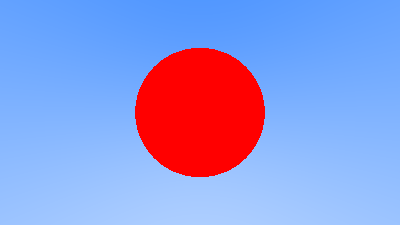

# 5. Adding a Sphere

## 5.1 Ray-Sphere Intersection

## 5.2 Creating Our First Raytraced Image

### Listing 10: Rendering a red sphere

```cpp
bool hit_sphere(const point3& center, double radius, const ray& r) {
    vec3 oc = r.origin() - center;
    auto a = dot(r.direction(), r.direction());
    auto b = 2.0 * dot(oc, r.direction());
    auto c = dot(oc, oc) - radius*radius;
    auto discriminant = b*b - 4*a*c;
    return (discriminant > 0);
}

color ray_color(const ray& r) {
    if (hit_sphere(point3(0,0,-1), 0.5, r))
        return color(1, 0, 0);
    vec3 unit_direction = unit_vector(r.direction());
    auto t = 0.5*(unit_direction.y() + 1.0);
    return (1.0-t)*color(1.0, 1.0, 1.0) + t*color(0.5, 0.7, 1.0);
}
```

Let's add a `hitSphere` function and update `rayColor` in `Main.idr` as follows:

```Idris
hitSphere : (center: Point3) -> (radius : Double) -> Ray -> Bool
hitSphere center radius (MkRay origin dir) =
  let
    oc : Vec3 = origin - center
    a : Double = dot dir dir
    b : Double = 2.0 * dot oc dir
    c : Double = (dot oc oc) - (radius * radius)
    discriminant : Double = (b * b) - (4 * a * c)
  in
    discriminant > 0

rayColor : Ray -> Color
rayColor r@(MkRay origin dir) =
  case hitSphere [0,0,-1] 0.5 r of
    True => [1, 0, 0]
    False =>
      let
        unitDir : Vec3 = unitVector dir
        t : Double = 0.5 * (getY unitDir) + 1
      in
        ((1.0 - t) <# [1, 1, 1]) + (t <# [0.5, 0.7, 1])
```

#### Image 3: A simple red sphere


