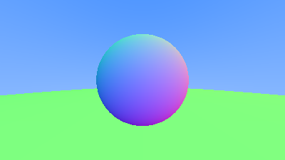

# 6 Surface Normals and Multiple Objects

## 6.1 Shading with Surface Normals

### Listing 11: Rendering surface normals on a sphere

```cpp
+ double hit_sphere(const point3& center, double radius, const ray& r) {
    vec3 oc = r.origin() - center;
    auto a = dot(r.direction(), r.direction());
    auto b = 2.0 * dot(oc, r.direction());
    auto c = dot(oc, oc) - radius*radius;
    auto discriminant = b*b - 4*a*c;
+    if (discriminant < 0) {
+        return -1.0;
+    } else {
+        return (-b - sqrt(discriminant) ) / (2.0*a);
+    }
}

color ray_color(const ray& r) {
+    auto t = hit_sphere(point3(0,0,-1), 0.5, r);
+    if (t > 0.0) {
+        vec3 N = unit_vector(r.at(t) - vec3(0,0,-1));
+        return 0.5*color(N.x()+1, N.y()+1, N.z()+1);
+    }
    vec3 unit_direction = unit_vector(r.direction());
+    t = 0.5*(unit_direction.y() + 1.0);
    return (1.0-t)*color(1.0, 1.0, 1.0) + t*color(0.5, 0.7, 1.0);
}
```

We make a similar set of changes in `Main.idr`:

```idris
hitSphere : (center: Point3) -> (radius : Double) -> Ray -> Double
hitSphere center radius (MkRay origin dir) =
  let
    oc : Vec3 = origin - center
    a : Double = dot dir dir
    b : Double = 2.0 * dot oc dir
    c : Double = (dot oc oc) - (radius * radius)
    discriminant : Double = (b * b) - (4 * a * c)
  in
    if discriminant < 0 then
      -1
    else
      ((0 - b) - (sqrt discriminant)) / (2*a)

rayColor : Ray -> Color
rayColor r@(MkRay origin dir) =
  let t : Double = hitSphere [0,0,-1] 0.5 r in
  if t > 0 then
    let N : Vec3 = unitVector ((rayAt r t) - [0, 0, -1]) in
    0.5 <# [(getX N) + 1, (getY N) + 1, (getZ N) + 1]
  else
    let
      unitDir : Vec3 = unitVector dir
      t : Double = 0.5 * (getY unitDir) + 1
    in
      ((1.0 - t) <# [1, 1, 1]) + (t <# [0.5, 0.7, 1])
```

#### Image 4: A sphere colored according to its normal vectors


## 6.2 Simplifying the Ray-Sphere Intersection Code subsection

### Listing 13: Ray-sphere intersection code (after)

```cpp
double hit_sphere(const point3& center, double radius, const ray& r) {
    vec3 oc = r.origin() - center;
+    auto a = r.direction().length_squared();
+    auto half_b = dot(oc, r.direction());
+    auto c = oc.length_squared() - radius*radius;
+    auto discriminant = half_b*half_b - a*c;

    if (discriminant < 0) {
        return -1.0;
    } else {
+        return (-half_b - sqrt(discriminant) ) / a;
    }
}
```

Which straightforwardly translates to:

```idris
hitSphere : (center: Point3) -> (radius : Double) -> Ray -> Double
hitSphere center radius (MkRay origin dir) =
  let
    oc : Vec3 = origin - center
    a : Double = lenSq dir
    halfB : Double = dot oc dir
    c : Double = (lenSq oc) - (radius * radius)
    discriminant : Double = (halfB * halfB) - (a * c)
  in
    if discriminant < 0 then
      -1
    else
      ((-halfB) - (sqrt discriminant)) / a
```

## 6.3 An Abstraction for Hittable Objects

### Listing 14: The `hittable` class

```cpp
#ifndef HITTABLE_H
#define HITTABLE_H

#include "ray.h"

struct hit_record {
    point3 p;
    vec3 normal;
    double t;
};

class hittable {
    public:
        virtual bool hit(const ray& r, double t_min, double t_max, hit_record& rec) const = 0;
};

#endif
```

Let's create a new file, `Hit.idr`, with the following definition.  Note that instead of returning a `bool` and updating the pass-by-ref `hit_record`, we instead return a `Maybe Hit`.  Also note that we are using our first Idris `interface`, which defines what is required for any type to be hittable, i.e., that it suppply a `hit` function.

```idris
module Hit

import public Ray

%access public export

record Hit where
  constructor MkHit
  point : Point3
  normal : Vec3
  t : Double

interface Hittable a where
  hit : Ray -> (tMin : Double) -> (tMax : Double) -> a -> Maybe Hit
```

### Listing 15: The `sphere` class

```cpp
#ifndef SPHERE_H
#define SPHERE_H

#include "hittable.h"
#include "vec3.h"

class sphere : public hittable {
    public:
        sphere() {}
        sphere(point3 cen, double r) : center(cen), radius(r) {};

        virtual bool hit(
            const ray& r, double tmin, double tmax, hit_record& rec) const override;

    public:
        point3 center;
        double radius;
};

bool sphere::hit(const ray& r, double t_min, double t_max, hit_record& rec) const {
    vec3 oc = r.origin() - center;
    auto a = r.direction().length_squared();
    auto half_b = dot(oc, r.direction());
    auto c = oc.length_squared() - radius*radius;
    auto discriminant = half_b*half_b - a*c;

    if (discriminant > 0) {
        auto root = sqrt(discriminant);

        auto temp = (-half_b - root) / a;
        if (temp < t_max && temp > t_min) {
            rec.t = temp;
            rec.p = r.at(rec.t);
            rec.normal = (rec.p - center) / radius;
            return true;
        }

        temp = (-half_b + root) / a;
        if (temp < t_max && temp > t_min) {
            rec.t = temp;
            rec.p = r.at(rec.t);
            rec.normal = (rec.p - center) / radius;
            return true;
        }
    }

    return false;
}

#endif
```

Create a new file, `Sphere.idr`, and migrate the logic from `Main.idr` into the `hit` function needed to make `Sphere` a `Hittable` type:

```idris
module Sphere

import public Hit

%access public export

record Sphere where
  constructor MkSphere
  center : Point3
  radius : Double

%name Sphere sphere, sphere1, sphere2

Hittable Sphere where
  hit ray@(MkRay origin dir) tMin tMax (MkSphere center radius) =
    let
      oc : Vec3 = origin - center
      a : Double = lenSq dir
      halfB : Double = dot oc dir
      c : Double = (lenSq oc) - (radius * radius)
      discriminant : Double = (halfB * halfB) - (a * c)
    in
      if discriminant > 0 then
        let
          root : Double = sqrt discriminant
        in
          case mkHitMaybe (((-halfB) - root) / a) of
            Just h => Just h
            Nothing => mkHitMaybe (((-halfB) + root) / a)
      else
        Nothing
    where
      mkHitMaybe : (t : Double) -> Maybe Hit
      mkHitMaybe t =
        if (t < tMax && t > tMin) then
          let
            point : Point3 = rayAt ray t
            normal : Vec3 = (1.0 / radius) <# (point - center)
          in
            Just (MkHit point normal t)
        else
          Nothing
```

## 6.4 Front Faces Versus Back Faces

### Listing 18: The `hittable` class with time and side

```cpp
struct hit_record {
    point3 p;
    vec3 normal;
    double t;
+    bool front_face;
+
+    inline void set_face_normal(const ray& r, const vec3& outward_normal) {
+        front_face = dot(r.direction(), outward_normal) < 0;
+        normal = front_face ? outward_normal :-outward_normal;
+    }
};
```

Since we need to perform some logic when creating a `Hit` record, we will add a _smart constructor_, `newHit`.
```idris
record Hit where
  constructor MkHit
  point : Point3
  normal : Vec3
  isFront : Bool
  t : Double

%name Hit hit, hit1, hit2

newHit : Ray -> (t : Double) -> Point3 -> (outwardNormal : Vec3) -> Hit
newHit (MkRay origin dir) t point outwardNormal =
  let
    isFront : Bool = (dot dir outwardNormal) < 0
    normal : Vec3 = if isFront then outwardNormal else (-outwardNormal)
  in
    MkHit point normal isFront t
```

### Listing 19: The `sphere` class with normal determination

```cpp
bool sphere::hit(const ray& r, double t_min, double t_max, hit_record& rec) const {
    vec3 oc = r.origin() - center;
    auto a = r.direction().length_squared();
    auto half_b = dot(oc, r.direction());
    auto c = oc.length_squared() - radius*radius;
    auto discriminant = half_b*half_b - a*c;

    if (discriminant > 0) {
        auto root = sqrt(discriminant);
        auto temp = (-half_b - root) / a;
        if (temp < t_max && temp > t_min) {
            rec.t = temp;
            rec.p = r.at(rec.t);
+            vec3 outward_normal = (rec.p - center) / radius;
+            rec.set_face_normal(r, outward_normal);
            return true;
        }
        temp = (-half_b + root) / a;
        if (temp < t_max && temp > t_min) {
            rec.t = temp;
            rec.p = r.at(rec.t);
+            vec3 outward_normal = (rec.p - center) / radius;
+            rec.set_face_normal(r, outward_normal);
            return true;
        }
    }
    return false;
}
```

Make the corresponding changes to the `hit` function in `Sphere.idr`:
```idris
Hittable Sphere where
  hit ray@(MkRay origin dir) tMin tMax (MkSphere center radius) =
    let
      oc : Vec3 = origin - center
      a : Double = lenSq dir
      halfB : Double = dot oc dir
      c : Double = (lenSq oc) - (radius * radius)
      discriminant : Double = (halfB * halfB) - (a * c)
    in
      if discriminant > 0 then
        let root : Double = sqrt discriminant in
        case mkHitMaybe (((-halfB) - root) / a) of
          Just h => Just h
          Nothing => mkHitMaybe (((-halfB) + root) / a)
      else
        Nothing
    where
      mkHitMaybe : (t : Double) -> Maybe Hit
      mkHitMaybe t =
        if (t < tMax && t > tMin) then
          let
            point : Point3 = rayAt ray t
            outwardNormal : Vec3 = (1.0 / radius) <# (point - center)
          in
            Just (newHit ray t point outwardNormal)
        else
          Nothing
```

## 6.5 A List of Hittable Objects

### Listing 20: The `hittable_list` class
```cpp
#ifndef HITTABLE_LIST_H
#define HITTABLE_LIST_H

#include "hittable.h"

#include <memory>
#include <vector>

using std::shared_ptr;
using std::make_shared;

class hittable_list : public hittable {
    public:
        hittable_list() {}
        hittable_list(shared_ptr<hittable> object) { add(object); }

        void clear() { objects.clear(); }
        void add(shared_ptr<hittable> object) { objects.push_back(object); }

        virtual bool hit(
            const ray& r, double tmin, double tmax, hit_record& rec) const override;

    public:
        std::vector<shared_ptr<hittable>> objects;
};

bool hittable_list::hit(const ray& r, double t_min, double t_max, hit_record& rec) const {
    hit_record temp_rec;
    bool hit_anything = false;
    auto closest_so_far = t_max;

    for (const auto& object : objects) {
        if (object->hit(r, t_min, closest_so_far, temp_rec)) {
            hit_anything = true;
            closest_so_far = temp_rec.t;
            rec = temp_rec;
        }
    }

    return hit_anything;
}
#endif
```

In Idris, we don't need a special collection like `hittable_list`.  Instead, we'll use a plain `List` and recursively search for the closest hit.  Let's add this logic to `Hit.idr`:

```idrs
closestHit : Hittable a => Ray -> (tMin : Double) -> (tMax : Double) -> List a -> Maybe Hit
closestHit _ _ _ [] = Nothing
closestHit ray tMin tMax (x :: xs) =
case hit ray tMin tMax x of
    Nothing => closestHit ray tMin tMax xs
    Just xHit =>
      case closestHit ray tMin (t xHit) xs of
        Nothing => Just xHit
        Just xsHit => Just xsHit
```

## 6.7 Common Constants and Utility Functions

### Listing 23: The `rtweekend.h` common header

```cpp
#ifndef RTWEEKEND_H
#define RTWEEKEND_H

#include <cmath>
#include <cstdlib>
#include <limits>
#include <memory>


// Usings

using std::shared_ptr;
using std::make_shared;
using std::sqrt;

// Constants

const double infinity = std::numeric_limits<double>::infinity();
const double pi = 3.1415926535897932385;

// Utility Functions

inline double degrees_to_radians(double degrees) {
    return degrees * pi / 180.0;
}

// Common Headers

#include "ray.h"
#include "vec3.h"

#endif
```

For us, the only things we need to specify is `infinity` and the `degreesToRadians` function.  Let's create a new file, `Util.idr`, to hold these definitions.

```idris
module Util

%access public export

infinity : Double
infinity = 2e+308

degToRad : (deg : Double) -> Double
degToRad deg = deg * pi / 180.0
```

### Listing 24: The new `main` with hittables

```cpp
+ #include "rtweekend.h"
+
+ #include "color.h"
+ #include "hittable_list.h"
+ #include "sphere.h"

#include <iostream>
+ color ray_color(const ray& r, const hittable& world) {
+     hit_record rec;
+     if (world.hit(r, 0, infinity, rec)) {
+         return 0.5 * (rec.normal + color(1,1,1));
+     }
    vec3 unit_direction = unit_vector(r.direction());
+     auto t = 0.5*(unit_direction.y() + 1.0);
    return (1.0-t)*color(1.0, 1.0, 1.0) + t*color(0.5, 0.7, 1.0);
}

int main() {

    // Image

    const auto aspect_ratio = 16.0 / 9.0;
    const int image_width = 400;
    const int image_height = static_cast<int>(image_width / aspect_ratio);

    // World
+     hittable_list world;
+     world.add(make_shared<sphere>(point3(0,0,-1), 0.5));
+     world.add(make_shared<sphere>(point3(0,-100.5,-1), 100));

    // Camera

    auto viewport_height = 2.0;
    auto viewport_width = aspect_ratio * viewport_height;
    auto focal_length = 1.0;

    auto origin = point3(0, 0, 0);
    auto horizontal = vec3(viewport_width, 0, 0);
    auto vertical = vec3(0, viewport_height, 0);
    auto lower_left_corner = origin - horizontal/2 - vertical/2 - vec3(0, 0, focal_length);

    // Render

    std::cout << "P3\n" << image_width << ' ' << image_height << "\n255\n";

    for (int j = image_height-1; j >= 0; --j) {
        std::cerr << "\rScanlines remaining: " << j << ' ' << std::flush;
        for (int i = 0; i < image_width; ++i) {
            auto u = double(i) / (image_width-1);
            auto v = double(j) / (image_height-1);
            ray r(origin, lower_left_corner + u*horizontal + v*vertical);
+             color pixel_color = ray_color(r, world);
            write_color(std::cout, pixel_color);
        }
    }

    std::cerr << "\nDone.\n";
}
```

We need to perform some surgery on `Main.idr`.  Let's begin by adding some new imports:

```idris
import Sphere
import Util
```

Next, add a _world_ section after the _image_ section:

```idris
{- World -}
s1 : Sphere
s1 = MkSphere [0, 0, -1] 0.5

s2 : Sphere
s2 = MkSphere [0, -100.5, -1] 100

world : List Sphere
world = [s1, s2]
```

Remove `hitSphere`, since it now lives as part of the new _hittable_ system we just implemented.

Update `rayColor` to process all the world objects:

```idris
rayColor : Hittable a => Ray -> List a -> Color
rayColor ray@(MkRay origin dir) world =
  case closestHit ray 0 infinity world of
    Just (MkHit _ normal _ _) => 0.5 <# (normal + [1, 1, 1])
    Nothing =>
      let
        unitDir : Vec3 = unitVector dir
        t : Double = 0.5 * (getY unitDir) + 1
      in
        ((1.0 - t) <# [1, 1, 1]) + (t <# [0.5, 0.7, 1])
```

Lastly, update the call to `rayColor` to include the world objects:

```idris
  c : Color = rayColor r world
```

#### Image 5: Resulting render of normals-colored sphere with ground


