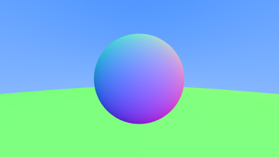

# 7. Antialiasing

## 7.1 Some Random Number Utilities

Idris is a _pure_ functional language, which means that functions have a property called _referential transparency_.

The [Effects](http://docs.idris-lang.org/en/latest/effects/simpleeff.html#random-numbers) package contains a random `Integer` function, `rndInt`.

When starting the Idris REPL, remember to include the package dependencies so you can interact with the source files, e.g., `idris -p contrib -p effects`.

### Listing 25: random_double() functions
```cpp
#include <cstdlib>
...

inline double random_double() {
    // Returns a random real in [0,1).
    return rand() / (RAND_MAX + 1.0);
}

inline double random_double(double min, double max) {
    // Returns a random real in [min,max).
    return min + (max-min)*random_double();
}
```

First, we need to import the Effects modules that give us access to random number generation.  In `Util.idr`, add:

```idris
import public Effects
import public Effect.Random
```

Next, add the `RAND_MAX` constant (taken from the C++ standard library) and the two functions:

```idris
RAND_MAX : Integer
RAND_MAX = 32767

randomUnitDouble : Eff Double [RND]
randomUnitDouble =
  pure $ (fromInteger !(rndInt 0 RAND_MAX)) / (1.0 + (fromInteger RAND_MAX))

randomDouble : (min : Double) -> (max : Double) -> Eff Double [RND]
randomDouble min max =
    pure $ (min + (max - min) * !randomUnitDouble)
```

Here's a small test routine that demonstrates how to call these random function:

```idris
test : IO (Double)
test =
  do
    pure $ runPure (randomDouble (-100) 100)
```

In order to build the project, we need to update the `ray.ipkg` file to include the effects package:

```
pkgs = contrib
     , effects
```

## 7.2 Generating Pixels with Multiple Samples

### Listing 27: The `camera` class

```cpp
#ifndef CAMERA_H
#define CAMERA_H

#include "rtweekend.h"

class camera {
    public:
        camera() {
            auto aspect_ratio = 16.0 / 9.0;
            auto viewport_height = 2.0;
            auto viewport_width = aspect_ratio * viewport_height;
            auto focal_length = 1.0;

            origin = point3(0, 0, 0);
            horizontal = vec3(viewport_width, 0.0, 0.0);
            vertical = vec3(0.0, viewport_height, 0.0);
            lower_left_corner = origin - horizontal/2 - vertical/2 - vec3(0, 0, focal_length);
        }

        ray get_ray(double u, double v) const {
            return ray(origin, lower_left_corner + u*horizontal + v*vertical - origin);
        }

    private:
        point3 origin;
        point3 lower_left_corner;
        vec3 horizontal;
        vec3 vertical;
};
#endif
```

Create a new file, `Camera.idr` to hold the definition of a camera, a smart constructor, and the function to get a ray for a given (u,v) value:

```idris
module Camera

import public Ray

%access public export

record Camera where
  constructor MkCamera
  origin : Point3
  lowerLeftCorner : Vec3
  horizontal : Vec3
  vertical : Vec3

newCamera : (aspectRatio : Double) -> (origin : Vec3) -> Camera
newCamera aspectRatio origin =
  let
    viewportHeight : Double = 2.0
    viewportWidth : Double = aspectRatio * viewportHeight
    focalLength : Double = 1.0;
    horizontal : Vec3 = [viewportWidth, 0, 0]
    vertical : Vec3 = [0, viewportHeight, 0];
    lowerLeftCorner : Vec3 =
      origin - (0.5 <# horizontal) - (0.5 <# vertical) - [0, 0, focalLength]
  in
    MkCamera origin lowerLeftCorner horizontal vertical

getRay : Camera -> (u : Double) -> (v : Double) -> Ray
getRay (MkCamera origin lowerLeftCorner horizontal vertical) u v =
  let
    uh : Vec3 = u <# horizontal
    vv : Vec3 = v <# vertical
  in
    MkRay origin (lowerLeftCorner + uh + vv - origin)
```

### Listing 28: The clamp() utility function

```cpp
inline double clamp(double x, double min, double max) {
    if (x < min) return min;
    if (x > max) return max;
    return x;
}
```

This is a straightforward translation in `Util.idr`, but note that we've placed the value to be clamped, `x`, in the _covariant_ ("positive") position (i.e., last), which it makes it amenable to use as a map operation.

```idris
clamp : (min : Double) -> (max : Double) -> (x : Double) -> Double
clamp min max x =
  if x < min then min
  else if x > max then max
  else x
```

### Listing 29: The multi-sample write_color() function

```cpp
void write_color(std::ostream &out, color pixel_color, int samples_per_pixel) {
    auto r = pixel_color.x();
    auto g = pixel_color.y();
    auto b = pixel_color.z();

    // Divide the color by the number of samples.
    auto scale = 1.0 / samples_per_pixel;
    r *= scale;
    g *= scale;
    b *= scale;

    // Write the translated [0,255] value of each color component.
    out << static_cast<int>(256 * clamp(r, 0.0, 0.999)) << ' '
        << static_cast<int>(256 * clamp(g, 0.0, 0.999)) << ' '
        << static_cast<int>(256 * clamp(b, 0.0, 0.999)) << '\n';
}
```

Our logic is a little different, so we need to update `Color.idr` as follows.  First, import `Util` for the `clamp` function:

```idris
import Util
```

Update the functions to scale and clamp the color values during conversion:

```idris
cvtColor : Double -> Bits8
cvtColor x = fromInteger (the Integer (cast (255.99 * (clamp 0 1 x))))

toRGB : Color -> (samplesPerPixel : Nat) -> RGB
toRGB color samplesPerPixel =
  let scale : Double = 1.0 / (fromInteger (toIntegerNat samplesPerPixel)) in
  map cvtColor (scale <# color)
```

### Listing 30: Rendering with multi-sampled pixels

```cpp
+ #include "camera.h"

...

int main() {

    // Image

    const auto aspect_ratio = 16.0 / 9.0;
    const int image_width = 400;
    const int image_height = static_cast<int>(image_width / aspect_ratio);
+     const int samples_per_pixel = 100;

    // World

    hittable_list world;
    world.add(make_shared<sphere>(point3(0,0,-1), 0.5));
    world.add(make_shared<sphere>(point3(0,-100.5,-1), 100));

    // Camera
+     camera cam;

    // Render

    std::cout << "P3\n" << image_width << " " << image_height << "\n255\n";

    for (int j = image_height-1; j >= 0; --j) {
        std::cerr << "\rScanlines remaining: " << j << ' ' << std::flush;
        for (int i = 0; i < image_width; ++i) {
+             color pixel_color(0, 0, 0);
+             for (int s = 0; s < samples_per_pixel; ++s) {
+                 auto u = (i + random_double()) / (image_width-1);
+                 auto v = (j + random_double()) / (image_height-1);
+                 ray r = cam.get_ray(u, v);
+                 pixel_color += ray_color(r, world);
+             }
+             write_color(std::cout, pixel_color, samples_per_pixel);
        }
    }

    std::cerr << "\nDone.\n";
}
```

Again, surgery is needed on `Main.idr` to reflect the above changes.  First, import the `Camera` module:

```idris
import Camera
```

Remove the old camera setup and replace it with just:

```idris
{- Camera -}
origin : Point3
origin = [0, 0, 0]

camera : Camera
camera = newCamera aspectRatio origin

samplesPerPixel : Nat
samplesPerPixel = 100
```

Add the sampling for antialiasing to the render loop:

```idris
{- Render loop -}
render : (h : Nat) -> (w : Nat) -> Eff (Matrix h w RGB) [RND]
render h w = sweepV h
  where
    sample : (x : Double) -> (y : Double) -> (samples : Nat) -> Eff Color [RND]
    sample _ _ Z = pure [0, 0, 0]
    sample x y (S k) =
      let
        u : Double = (x + !randomUnitDouble) / (cast (minus w 1))
        v : Double = (y + !randomUnitDouble) / (cast (minus h 1))
        ray : Ray = getRay camera u v
        color : Color = rayColor ray world
      in
        pure $ color + !(sample x y k)

    sweepH : (i : Nat) -> (j : Nat) -> Eff (Vect i RGB) [RND]
    sweepH Z _ = pure Nil
    sweepH (S i) j =
      let
        i' : Nat = minus w (plus i 1)
        color : Color = !(sample (cast i') (cast j) samplesPerPixel)
      in
        pure $ (toRGB color samplesPerPixel) :: !(sweepH i j)

    sweepV : (j : Nat) -> Eff (Matrix j w RGB) [RND]
    sweepV Z = pure (Nil)
    sweepV (S j) = pure $ !(sweepH w j) :: !(sweepV j)
```

Because we are now calling a effect-ful function, we need to change `main` to call it using `runPure`:

```idris
main : IO ()
main = do
  putStrLn "Rendering..."
  let image = runPure $ render imageHeight imageWidth
  savePPM "test.ppm" image
  putStrLn "Done!"
```

### Image 6: Before and after antialiasng


