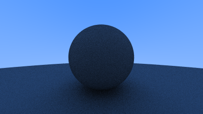
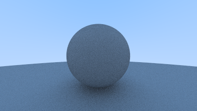
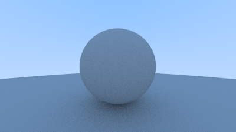
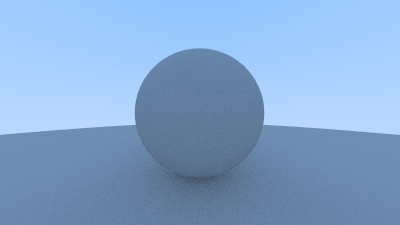

# 8. Diffuse Materials

## 8.1 A Simple Diffuse Material

### Listing 31: vec3 random utility functions

```cpp
class vec3 {
  public:
    ...
    inline static vec3 random() {
        return vec3(random_double(), random_double(), random_double());
    }

    inline static vec3 random(double min, double max) {
        return vec3(random_double(min,max), random_double(min,max), random_double(min,max));
    }
```

Let's add equivalent function to `Vec3.idr`.  First, let's include the random functions that we previously added to our utility module:

```idris
import public Util

...

random : Eff Vec3 [RND]
random = pure $ [!randomUnitDouble, !randomUnitDouble, !randomUnitDouble]

randomIn : (min : Double) -> (max : Double) -> Eff Vec3 [RND]
randomIn min max =
  pure $ [!(randomDouble min max), !(randomDouble min max), !(randomDouble min max)]
```

### Listing 32: The random_in_unit_sphere() function

```cpp
vec3 random_in_unit_sphere() {
    while (true) {
        auto p = vec3::random(-1,1);
        if (p.length_squared() >= 1) continue;
        return p;
    }
}
```

Also in `Vec3.idr`:

```idris
randomInUnitSphere : Eff Vec3 [RND]
randomInUnitSphere =
  let
    p : Vec3 = !(randomIn (-1) 1)
    l : Double = lenSq p
  in
    if p >= 1 then randomInUnitSphere else pure p
```

Note that this technique is quite slow.  We'll switch to a faster method shortly.

#### Testing

```idris
test : IO (Vec3)
test =
  do
    pure $ runPure randomInUnitSphere
```

### Listing 33: ray_color() using a random ray direction
```cpp
color ray_color(const ray& r, const hittable& world) {
    hit_record rec;

    if (world.hit(r, 0, infinity, rec)) {
+        point3 target = rec.p + rec.normal + random_in_unit_sphere();
+        return 0.5 * ray_color(ray(rec.p, target - rec.p), world);
    }

    vec3 unit_direction = unit_vector(r.direction());
    auto t = 0.5*(unit_direction.y() + 1.0);
    return (1.0-t)*color(1.0, 1.0, 1.0) + t*color(0.5, 0.7, 1.0);
}
```

In `Main.idr`:

```idris
rayColor : Hittable a => Ray -> List a -> Eff Color [RND]
rayColor ray@(MkRay origin dir) world =
  case closestHit ray 0 infinity world of
    Just (MkHit point normal _ _) =>
      let
        target : Point3 = point + normal + !randomInUnitSphere
      in
        pure $ 0.5 <# !(rayColor (MkRay point (target - point)) world)
    Nothing =>
      let
        unitDir : Vec3 = unitVector dir
        t : Double = 0.5 * (getY unitDir) + 1
      in
        pure $ ((1.0 - t) <# [1, 1, 1]) + (t <# [0.5, 0.7, 1])
```

Update the call to `rayColor` in `render`:
```idris
    ...
        v : Double = (y + !randomUnitDouble) / (cast (minus h 1))
        ray : Ray = getRay camera u v
        color : Color = !(rayColor ray world)
      in
        pure $ color + !(sample x y k)
    ...
```

## 8.2 Limiting the Number of Child Rays

### Listing 34: ray_color() with depth limiting

```cpp
+ color ray_color(const ray& r, const hittable& world, int depth) {
    hit_record rec;

+    // If we've exceeded the ray bounce limit, no more light is gathered.
+    if (depth <= 0)
+        return color(0,0,0);

    if (world.hit(r, 0, infinity, rec)) {
        point3 target = rec.p + rec.normal + random_in_unit_sphere();
+        return 0.5 * ray_color(ray(rec.p, target - rec.p), world, depth-1);
    }

    vec3 unit_direction = unit_vector(r.direction());
    auto t = 0.5*(unit_direction.y() + 1.0);
    return (1.0-t)*color(1.0, 1.0, 1.0) + t*color(0.5, 0.7, 1.0);
}

...

int main() {

    // Image

    const auto aspect_ratio = 16.0 / 9.0;
    const int image_width = 400;
    const int image_height = static_cast<int>(image_width / aspect_ratio);
    const int samples_per_pixel = 100;
+    const int max_depth = 50;
    ...

    // Render

    std::cout << "P3\n" << image_width << " " << image_height << "\n255\n";

    for (int j = image_height-1; j >= 0; --j) {
        std::cerr << "\rScanlines remaining: " << j << ' ' << std::flush;
        for (int i = 0; i < image_width; ++i) {
            color pixel_color(0, 0, 0);
            for (int s = 0; s < samples_per_pixel; ++s) {
                auto u = (i + random_double()) / (image_width-1);
                auto v = (j + random_double()) / (image_height-1);
                ray r = cam.get_ray(u, v);
+                pixel_color += ray_color(r, world, max_depth);
            }
            write_color(std::cout, pixel_color, samples_per_pixel);
        }
    }

    std::cerr << "\nDone.\n";
}
```

Update `rayColor` in `Main.idr`:
```idris
rayColor : Hittable a => Ray -> List a -> (depth : Nat) -> Eff Color [RND]
rayColor _ _ Z = pure [0, 0, 0] -- ray bounce limit, no more light is gathered
rayColor ray@(MkRay origin dir) world (S depth) =
  case closestHit ray 0 infinity world of
    Just (MkHit point normal _ _) =>
      let
        target : Point3 = point + normal + !randomInUnitSphere
      in
        pure $ 0.5 <# !(rayColor (MkRay point (target - point)) world depth)
  ...
```

Add a new `{- Camera -}` constant in `Main.idr`:

```idris
maxDepth : Nat
maxDepth = 50
```

Update the call to `rayColor` in `render`:

```idris
        u : Double = (x + !randomUnitDouble) / (cast (minus w 1))
        v : Double = (y + !randomUnitDouble) / (cast (minus h 1))
        ray : Ray = getRay camera u v
        color : Color = !(rayColor ray world maxDepth)
```

#### Image 7: First render of a diffuse sphere



## 8.3 Using Gamma Correction for Accurate Color Intensity

### Listing 35: write_color(), with gamma correction

```cpp
void write_color(std::ostream &out, color pixel_color, int samples_per_pixel) {
    auto r = pixel_color.x();
    auto g = pixel_color.y();
    auto b = pixel_color.z();

+  // Divide the color by the number of samples and gamma-correct for gamma=2.0.
+  auto scale = 1.0 / samples_per_pixel;
+  r = sqrt(scale * r);
+  g = sqrt(scale * g);
+  b = sqrt(scale * b);

  // Write the translated [0,255] value of each color component.
  out << static_cast<int>(256 * clamp(r, 0.0, 0.999)) << ' '
      << static_cast<int>(256 * clamp(g, 0.0, 0.999)) << ' '
      << static_cast<int>(256 * clamp(b, 0.0, 0.999)) << '\n';
}
```

We can apply this adjustment in `Color.idr` and, while we're at it, we can clean up the function a little by separating the calculations from the type conversion.  We can also consolidate all of the calculations by refactoring the `toRGB` function as well:

```idris
cvtColor : (scale: Double) -> (color : Double) -> Bits8
cvtColor scale color =
  let
    scaled       : Double = scale * color
    gammaCorrect : Double = sqrt scaled
    clamped      : Double = clamp 0 1 gammaCorrect
    byteRange    : Double = 255.99 * clamped
  in
    fromInteger (the Integer (cast byteRange))

toRGB : Color -> (samplesPerPixel : Nat) -> RGB
toRGB color samplesPerPixel =
  let scale : Double = 1.0 / (fromInteger (toIntegerNat samplesPerPixel)) in
  map (cvtColor scale) color
```

#### Image 8: Diffuse sphere, with gamma correction



## 8.4 Fixing Shadow Acne

### Listing 36: Calculating reflected ray origins with tolerance

```cpp
if (world.hit(r, 0.001, infinity, rec)) {
```

We make this adjustment in `rayColor` in `Main.idr`:

```idris
  case closestHit ray 0.001 infinity world of
```

## 8.5 True Lambertian Reflection

### Listing 37: The random_unit_vector() function

```cpp
vec3 random_unit_vector() {
    auto a = random_double(0, 2*pi);
    auto z = random_double(-1, 1);
    auto r = sqrt(1 - z*z);
    return vec3(r*cos(a), r*sin(a), z);
}
```

Since this id a drop-in replacement of the `randomInUnitSphere`, which used the _rejection method_, let's actually replace the function and simply rename the existing one in `Vec3.idr`:

```idris
-- use the rejection method: pick a point in the unit cube, test that it falls in within the unit sphere
randomInUnitSphereR : Eff Vec3 [RND]
randomInUnitSphereR =
  let
    p : Vec3 = !(randomIn (-1) 1)
    l : Double = lenSq p
  in
    if p >= 1 then randomInUnitSphereR else pure p

-- pick points on the unit ball and scale them
randomInUnitSphere : Eff Vec3 [RND]
randomInUnitSphere =
  let
    a : Double = !(randomDouble 0 (2 * pi))
    z : Double = !(randomDouble (-1) 1)
    r : Double = sqrt (1 - (z * z))
    p : Vec3 = [r * (cos a), r * (sin a), z]
  in
    pure p
```

### Listing 38: ray_color() with replacement diffuse

```cpp
color ray_color(const ray& r, const hittable& world, int depth) {
    hit_record rec;

    // If we've exceeded the ray bounce limit, no more light is gathered.
    if (depth <= 0)
        return color(0,0,0);

    if (world.hit(r, 0.001, infinity, rec)) {
+        point3 target = rec.p + rec.normal + random_unit_vector();
        return 0.5 * ray_color(ray(rec.p, target - rec.p), world, depth-1);
    }

    vec3 unit_direction = unit_vector(r.direction());
    auto t = 0.5*(unit_direction.y() + 1.0);
    return (1.0-t)*color(1.0, 1.0, 1.0) + t*color(0.5, 0.7, 1.0);
}
```

No change is needed, since we replaced the `randomInUnitSphere` function.

#### Image 9: Correct rendering of Lambertian spheres



## 8.6 An Alternative Diffuse Formulation

### Listing 39: The random_in_hemisphere(normal) function

```cpp
vec3 random_in_hemisphere(const vec3& normal) {
    vec3 in_unit_sphere = random_in_unit_sphere();
    if (dot(in_unit_sphere, normal) > 0.0) // In the same hemisphere as the normal
        return in_unit_sphere;
    else
        return -in_unit_sphere;
}
```

Add the new function to `Vec3`.  Note that, as in the original, we use the rejection method (which is a lot slower).

```idris
randomInHemisphere : (normal : Vec3) -> Eff Vec3 [RND]
randomInHemisphere normal =
  let
    inUnitSphere : Vec3 = !randomInUnitSphereR
  in
    if (dot inUnitSphere normal) > 0 then
      pure inUnitSphere
    else
      pure (-inUnitSphere)
```

### Listing 40: ray_color() with hemispherical scattering

```cpp
color ray_color(const ray& r, const hittable& world, int depth) {
    hit_record rec;

    // If we've exceeded the ray bounce limit, no more light is gathered.
    if (depth <= 0)
        return color(0,0,0);

    if (world.hit(r, 0.001, infinity, rec)) {
+        point3 target = rec.p + random_in_hemisphere(rec.normal);
        return 0.5 * ray_color(ray(rec.p, target - rec.p), world, depth-1);
    }

    vec3 unit_direction = unit_vector(r.direction());
    auto t = 0.5*(unit_direction.y() + 1.0);
    return (1.0-t)*color(1.0, 1.0, 1.0) + t*color(0.5, 0.7, 1.0);
}
```

Update the `rayColor` function in `Main.idr` to use the new hemispherical scattering function:

```idris
case closestHit ray 0.001 infinity world of
  Just (MkHit point normal _ _) =>
    let
      target : Point3 = point + !(randomInHemisphere normal)
```

#### Image 10: Rendering of diffuse spheres with hemispherical scattering


