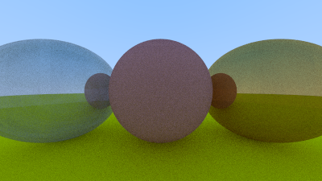
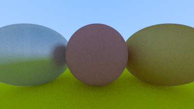

# 9. Metal

## 9.1 An Abstract Class for Materials

The design decision in C++ was to have an abstract material class to do two things:

- Produce a scattered ray (or say it absorbed the incident ray).
- If scattered, say how much the ray should be attenuated.

This approach suggests the use of an Idris interface, `Material`, which will declare a function, `scatter`, that all conforming types must provide.

### Listing 41: The material class

```cpp
#ifndef MATERIAL_H
#define MATERIAL_H

#include "rtweekend.h"

struct hit_record;

class material {
    public:
        virtual bool scatter(
            const ray& r_in, const hit_record& rec, color& attenuation, ray& scattered
        ) const = 0;
};

#endif
```

Note that the `scatter` method takes a `hit_record` as an argument.  We'll return to this point in a moment.

## 9.2 A Data Structure to Describe Ray-Object Intersections

This new class is then added to the `hit_record` structure:

### Listing 42: Hit record with added material pointer

```cpp
#include "rtweekend.h"
#include "ray.h"

+ class material;

struct hit_record {
    point3 p;
    vec3 normal;
+    shared_ptr<material> mat_ptr;
    double t;
    bool front_face;

    inline void set_face_normal(const ray& r, const vec3& outward_normal) {
        front_face = dot(r.direction(), outward_normal) < 0;
        normal = front_face ? outward_normal :-outward_normal;
    }
};
```

However, this creates a **circular reference**, as Peter describes in section 9.2.  If we were to add `Material` to our `Hit` record, we'd introduce an **import cycle**, since `Material.idr` would rely on `Hit.idr` and `Hit.idr` would rely on `Material.idr`.  This cycle is not a problem for C++, which can use a _forward declaration_.  Idris has no such concept.

We can refactor `Hit` to include a `HitPoint` by first creating a new file, `HitPoint.idr`, with the following definition:

```idris
module HitPoint

import public Ray

%access public export

record HitPoint where
  constructor MkHitPoint
  point : Point3
  normal : Vec3
  isFront : Bool
  t : Double

%name HitPoint hitPt, hitPt1, hitPt2

newHitPoint : Ray -> (t : Double) -> Point3 -> (outwardNormal : Vec3) -> Hit
newHitPoint (MkRay origin dir) t point outwardNormal =
  let
    isFront : Bool = (dot dir outwardNormal) < 0
    normal : Vec3 = if isFront then outwardNormal else (-outwardNormal)
  in
    MkHitPoint point normal isFront t
```

We create a new file, `Material.idr`, import a few dependencies, and define a `Material` interface with the declaration of `scatter` function.

Note that the C++ `scattering` function returns a `bool` indicating whether or not it scattered.  Note that two of the arguments are pass-by-ref and are potentially updated by the function.  Since this is not an option for us, we instead define a new record, `Scattering` to hold this information and return a `Maybe` to indicate that it may not produce a value.

Additionally, the concrete `scatter` functions will possibly require use of random number generator, so we ensure the `RND` effect is available.

```idris
module Material

import public Color
import public HitPoint

%access public export

record Scattering where
  constructor MkScattering
  attenuation : Color
  scattered : Ray

interface Material a where
  scatter : Ray -> HitPoint -> a -> Eff (Maybe Scattering) [RND]
```

Since `Material.idr` does not reference `Hit.idr`, we need add the material to the hit record:

```idris
module Hit

import public HitPoint
import public Material

%access public export

record Hit where
  constructor MkHit
  hitPoint : HitPoint
  material : Material m => m
```

**However, this won't work as expected.**  Recall that `record` is syntactic sugar for `data` syntax, which, in this case, doesn't give us what we want.  The difference being `MkHit : (forall a. Material a => a) -> Hit` vs `MkHit : forall a. Material a => a -> Hit`.

```idris
data Hit : Type -> Type where
  MkHit :
    Material m =>
    (hitPoint : HitPoint) ->
    (material : m) ->
    Hit m

hitPoint : Hit m -> HitPoint
hitPoint (MkHit hitPoint _) = hitPoint

material : Hit m -> m
material (MkHit _ mat) = mat
```

We need to update our smart constructor to defer to the `HitPoint` smart constructor:

```idris
newHit : Material m => Ray -> (t : Double) -> Point3 -> (outwardNormal : Vec3) -> m -> Hit
newHit ray t point outwardNormal material =
  MkHit (newHitPoint ray t point outwardNormal) material
```

And patch the `closestHit` function where it accesses the `t` value from the hit record, which is now in the `hitPoint` field:
```idris
    Just xHit =>
      case closestHit ray tMin (t (hitPoint xHit)) xs of
        Nothing => Just xHit
```

### Listing 43: Ray-sphere intersection with added material information

```cpp
class sphere : public hittable {
    public:
        sphere() {}
+        sphere(point3 cen, double r, shared_ptr<material> m)
+            : center(cen), radius(r), mat_ptr(m) {};

        virtual bool hit(
            const ray& r, double tmin, double tmax, hit_record& rec) const override;

    public:
        point3 center;
        double radius;
+        shared_ptr<material> mat_ptr;
};

bool sphere::hit(const ray& r, double t_min, double t_max, hit_record& rec) const {
    vec3 oc = r.origin() - center;
    auto a = r.direction().length_squared();
    auto half_b = dot(oc, r.direction());
    auto c = oc.length_squared() - radius*radius;
    auto discriminant = half_b*half_b - a*c;

    if (discriminant > 0) {
        auto root = sqrt(discriminant);
        auto temp = (-half_b - root) / a;
        if (temp < t_max && temp > t_min) {
            rec.t = temp;
            rec.p = r.at(rec.t);
            vec3 outward_normal = (rec.p - center) / radius;
            rec.set_face_normal(r, outward_normal);
+            rec.mat_ptr = mat_ptr;
            return true;
        }
        temp = (-half_b + root) / a;
        if (temp < t_max && temp > t_min) {
            rec.t = temp;
            rec.p = r.at(rec.t);
            vec3 outward_normal = (rec.p - center) / radius;
            rec.set_face_normal(r, outward_normal);
+            rec.mat_ptr = mat_ptr;
            return true;
        }
    }
    return false;
}
```

Just as we did for `Hit`, let's convert from the `record` syntax to the `data` syntax for `Sphere`:

```idris
data Sphere : Type where
  MkSphere :
    Material m =>
    (center : Point3) ->
    (radius : Double) ->
    (material : m) ->
    Sphere
```

Of course, one of the things we lose when switching away from `record` syntax is the automatic creation of setters and getters.  We don't need them, but we can add them later if we do.

And update the definition of `hit` to include the `material` variable:
```idris
Hittable Sphere where
  hit ray@(MkRay origin dir) tMin tMax (MkSphere center radius material) =
```

Lastly, add `material` when constructing a new hit record:

```idris
let
  point : Point3 = rayAt ray t
  outwardNormal : Vec3 = (1.0 / radius) <# (point - center)
in
  Just (newHit ray t point outwardNormal material)
```

## 9.3 Modeling Light Scatter and Reflectance

### Listing 44: The lambertian material class

```cpp
class lambertian : public material {
    public:
        lambertian(const color& a) : albedo(a) {}

        virtual bool scatter(
            const ray& r_in, const hit_record& rec, color& attenuation, ray& scattered
        ) const override {
            vec3 scatter_direction = rec.normal + random_unit_vector();
            scattered = ray(rec.p, scatter_direction);
            attenuation = albedo;
            return true;
        }

    public:
        color albedo;
};
```

We will create a `record` to hold the `albedo`, define the `scatter` function for Lambertian material, then make `Lambertian` an instance of `Material`:

```idris
{- Lambertian -}

record Lambertian where
  constructor MkLambertian
  albedo : Color

scatterLambertian : Ray -> HitPoint -> Lambertian -> Eff (Maybe Scattering) [RND]
scatterLambertian (MkRay origin dir) (MkHitPoint point normal _ _) (MkLambertian albedo) =
  let
    scatterDir : Vec3 = normal + !randomUnitVector
    scattered : Ray = MkRay point scatterDir
  in
    pure $ Just (MkScattering albedo scattered)

Material Lambertian where
  scatter = scatterLambertian
```

## 9.4 Mirrored Light Reflection

### Listing 45: vec3 reflection function

```cpp
vec3 reflect(const vec3& v, const vec3& n) {
    return v - 2*dot(v,n)*n;
}
```

We add the folloing definition to `Vec3.idr`:

```idris
reflect : (v : Vec3) -> (n : Vec3) -> Vec3
reflect v n = v - ((2 * (dot v n)) <# n)
```

### Listing 46: Metal material with reflectance function

```cpp
class metal : public material {
    public:
        metal(const color& a) : albedo(a) {}

        virtual bool scatter(
            const ray& r_in, const hit_record& rec, color& attenuation, ray& scattered
        ) const override {
            vec3 reflected = reflect(unit_vector(r_in.direction()), rec.normal);
            scattered = ray(rec.p, reflected);
            attenuation = albedo;
            return (dot(scattered.direction(), rec.normal) > 0);
        }

    public:
        color albedo;
};
```

Back in `Material.idr`, we add the following definition of the `Metal` material:

```idris
{- Metal -}

record Metal where
  constructor MkMetal
  albedo : Color

scatterMetal : Ray -> HitPoint -> Metal -> Eff (Maybe Scattering) [RND]
scatterMetal (MkRay origin dir) (MkHitPoint point normal _ _) (MkMetal albedo) =
  let
    reflected : Vec3 = reflect (unitVector dir) normal
  in
    if dot reflected normal > 0 then
      pure $ Just (MkScattering albedo (MkRay point reflected))
    else
      pure $ Nothing

Material Metal where
  scatter = scatterMetal
```

### Listing 47: Ray color with scattered reflectance

```cpp
color ray_color(const ray& r, const hittable& world, int depth) {
    hit_record rec;

    // If we've exceeded the ray bounce limit, no more light is gathered.
    if (depth <= 0)
        return color(0,0,0);

    if (world.hit(r, 0.001, infinity, rec)) {
+        ray scattered;
+        color attenuation;
+        if (rec.mat_ptr->scatter(r, rec, attenuation, scattered))
+            return attenuation * ray_color(scattered, world, depth-1);
+        return color(0,0,0);
    }

    vec3 unit_direction = unit_vector(r.direction());
    auto t = 0.5*(unit_direction.y() + 1.0);
    return (1.0-t)*color(1.0, 1.0, 1.0) + t*color(0.5, 0.7, 1.0);
}
```

In `Main.idr`, we update the `rayColor` definition as follows:

```idris
case closestHit ray 0 infinity world of
  Just (MkHit hitPoint material) =>
    case !(scatter ray hitPoint material) of
      Just (MkScattering attenuation scattered) =>
        pure $ attenuation * !(rayColor scattered world depth)
      Nothing => pure $ [0, 0, 0]
  Nothing =>
```

## 9.5 A Scene with Metal Spheres

### Listing 48: Scene with metal spheres

```cpp
...

#include "material.h"

...

int main() {

    // Image

    const auto aspect_ratio = 16.0 / 9.0;
    const int image_width = 400;
    const int image_height = static_cast<int>(image_width / aspect_ratio);
    const int samples_per_pixel = 100;
    const int max_depth = 50;

    // World

    hittable_list world;

+    auto material_ground = make_shared<lambertian>(color(0.8, 0.8, 0.0));
+    auto material_center = make_shared<lambertian>(color(0.7, 0.3, 0.3));
+    auto material_left   = make_shared<metal>(color(0.8, 0.8, 0.8));
+    auto material_right  = make_shared<metal>(color(0.8, 0.6, 0.2));

+    world.add(make_shared<sphere>(point3( 0.0, -100.5, -1.0), 100.0, material_ground));
+    world.add(make_shared<sphere>(point3( 0.0,    0.0, -1.0),   0.5, material_center));
+    world.add(make_shared<sphere>(point3(-1.0,    0.0, -1.0),   0.5, material_left));
+    world.add(make_shared<sphere>(point3( 1.0,    0.0, -1.0),   0.5, material_right));

    // Camera

    camera cam;

    // Render

    std::cout << "P3\n" << image_width << " " << image_height << "\n255\n";

    for (int j = image_height-1; j >= 0; --j) {
        std::cerr << "\rScanlines remaining: " << j << ' ' << std::flush;
        for (int i = 0; i < image_width; ++i) {
            color pixel_color(0, 0, 0);
            for (int s = 0; s < samples_per_pixel; ++s) {
                auto u = (i + random_double()) / (image_width-1);
                auto v = (j + random_double()) / (image_height-1);
                ray r = cam.get_ray(u, v);
                pixel_color += ray_color(r, world, max_depth);
            }
            write_color(std::cout, pixel_color, samples_per_pixel);
        }
    }

    std::cerr << "\nDone.\n";
}
```

```idris
{- World -}
materialGround : Lambertian
materialGround = MkLambertian [0.8, 0.8, 0.0]

materialCenter : Lambertian
materialCenter = MkLambertian [0.7, 0.3, 0.3]

materialLeft : Metal
materialLeft = MkMetal [0.8, 0.8, 0.8]

materialRight : Metal
materialRight = MkMetal [0.8, 0.6, 0.2]

world : List Sphere
world = [
    MkSphere [0, -100.5, -1] 100 materialGround
  , MkSphere [0, 0, -1] 0.5 materialCenter
  , MkSphere [-1, 0, -1] 0.5 materialLeft
  , MkSphere [1, 0, -1] 0.5 materialRight
  ]
```

#### Image 11: Shiny Metal



## 9.6 Fuzzy Reflection

### Listing 49: Metal material fuzziness

```cpp
class metal : public material {
    public:
        metal(const color& a, double f) : albedo(a), fuzz(f < 1 ? f : 1) {}

        virtual bool scatter(
            const ray& r_in, const hit_record& rec, color& attenuation, ray& scattered
        ) const override {
            vec3 reflected = reflect(unit_vector(r_in.direction()), rec.normal);
            scattered = ray(rec.p, reflected + fuzz*random_in_unit_sphere());
            attenuation = albedo;
            return (dot(scattered.direction(), rec.normal) > 0);
        }

    public:
        color albedo;
        double fuzz;
};
```

```idris
record Metal where
  constructor MkMetal
  albedo : Color
  fuzz : Double

newMetal : Color -> (fuzz : Double) -> Metal
newMetal albedo fuzz = MkMetal albedo (if fuzz < 1 then fuzz else 1)

scatterMetal : Ray -> HitPoint -> Metal -> Eff (Maybe Scattering) [RND]
scatterMetal (MkRay origin dir) (MkHitPoint point normal _ _) (MkMetal albedo fuzz) =
  let
    reflected : Vec3 = reflect (unitVector dir) normal
  in
    if dot reflected normal > 0 then
      pure $ Just (MkScattering albedo (MkRay point (reflected + (fuzz <# !randomInUnitSphere))))
    else
      pure $ Nothing
```

### Listing 50: Metal spheres with fuzziness

```cpp
int main() {
    ...
    // World

    auto material_ground = make_shared<lambertian>(color(0.8, 0.8, 0.0));
    auto material_center = make_shared<lambertian>(color(0.7, 0.3, 0.3));
    auto material_left   = make_shared<metal>(color(0.8, 0.8, 0.8), 0.3);
    auto material_right  = make_shared<metal>(color(0.8, 0.6, 0.2), 1.0);
    ...
}
```

```idris
materialLeft : Metal
materialLeft = newMetal [0.8, 0.8, 0.8] 0.3

materialRight : Metal
materialRight = newMetal [0.8, 0.6, 0.2] 1
```

#### Image 12: Fuzzed Metal


