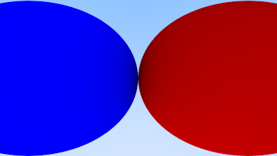
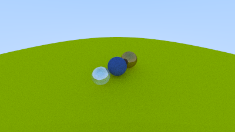
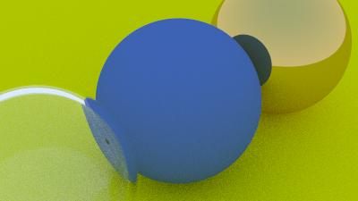

# 11. Positionable Camera

## 11.1 Camera Viewing Geometry

### Listing 61: Camera with adjustable field-of-view (fov)

```cpp
class camera {
    public:
+         camera(
+             double vfov, // vertical field-of-view in degrees
+             double aspect_ratio
+         ) {
+             auto theta = degrees_to_radians(vfov);
+             auto h = tan(theta/2);
+             auto viewport_height = 2.0 * h;
+             auto viewport_width = aspect_ratio * viewport_height;

            auto focal_length = 1.0;

            origin = point3(0, 0, 0);
            horizontal = vec3(viewport_width, 0.0, 0.0);
            vertical = vec3(0.0, viewport_height, 0.0);
            lower_left_corner = origin - horizontal/2 - vertical/2 - vec3(0, 0, focal_length);
        }

        ray get_ray(double u, double v) const {
            return ray(origin, lower_left_corner + u*horizontal + v*vertical - origin);
        }

    private:
        point3 origin;
        point3 lower_left_corner;
        vec3 horizontal;
        vec3 vertical;
};
```

We can modify the camera's smart constructor to accept the vertical field-of-view and calculate the viewport height in `Camera.idr`:

```idris
newCamera : (origin : Vec3) -> (fvof : Double) -> (aspectRatio : Double) -> Camera
newCamera origin fvof aspectRatio =
  let
    theta : Double = degToRad fvof
    h : Double = tan (theta/2.0)
    viewportHeight : Double = 2.0 * h
```

### Listing 62: Scene with wide-angle camera

```cpp
int main() {
    ...
    // World

    +     auto R = cos(pi/4);
    +     hittable_list world;
    +
    +     auto material_left  = make_shared<lambertian>(color(0,0,1));
    +     auto material_right = make_shared<lambertian>(color(1,0,0));
    +
    +     world.add(make_shared<sphere>(point3(-R, 0, -1), R, material_left));
    +     world.add(make_shared<sphere>(point3( R, 0, -1), R, material_right));

        // Camera

    +    camera cam(90.0, aspect_ratio);

        // Render

        std::cout << "P3\n" << image_width << " " << image_height << "\n255\n";

        for (int j = image_height-1; j >= 0; --j) {
        ...
```

The equivalent setup in `Main.idr` is:

```idris
R : Double
R = cos (pi / 4.0)

materialLeft : Lambertian
materialLeft = MkLambertian [0, 0, 1]

materialRight : Lambertian
materialRight = MkLambertian [1, 0, 0]

world : List Sphere
world = [
    MkSphere [-R, 0, -1] R materialLeft
  , MkSphere [ R, 0, -1] R materialRight
  ]

camera : Camera
camera = newCamera 90 aspectRatio origin

```

#### Image 17: A wide-angle view



## 11.2 Positioning and Orienting the Camera

### Listing 63: Positionable and orientable camera

```cpp
class camera {
    public:
        camera(
+             point3 lookfrom,
+             point3 lookat,
+             vec3   vup,
            double vfov, // vertical field-of-view in degrees
            double aspect_ratio
        ) {
            auto theta = degrees_to_radians(vfov);
            auto h = tan(theta/2);
            auto viewport_height = 2.0 * h;
            auto viewport_width = aspect_ratio * viewport_height;

+             auto w = unit_vector(lookfrom - lookat);
+             auto u = unit_vector(cross(vup, w));
+             auto v = cross(w, u);
+
+             origin = lookfrom;
+             horizontal = viewport_width * u;
+             vertical = viewport_height * v;
+             lower_left_corner = origin - horizontal/2 - vertical/2 - w;
        }

+         ray get_ray(double s, double t) const {
+             return ray(origin, lower_left_corner + s*horizontal + t*vertical - origin);
+         }

    private:
        point3 origin;
        point3 lower_left_corner;
        vec3 horizontal;
        vec3 vertical;
};
```

We need only update our smart constructor in `Camera.idr`:
```idris
newCamera : (origin : Point3) ->
            (lookAt : Point3) ->
            (vUp : Vec3) ->
            (fvof : Double) ->
            (aspectRatio : Double) ->
            Camera
newCamera origin fvof aspectRatio =
  let
    theta : Double = degToRad fvof
    h : Double = tan (theta/2.0)
    viewportHeight : Double = 2.0 * h
    viewportWidth : Double = aspectRatio * viewportHeight

    w : Vec3 = unitVector (origin - lookAt)
    u : Vec3 = unitVector (cross vUp w)
    v : Vec3 = cross w u

    horizontal : Vec3 = viewportWidth <# u
    vertical : Vec3 = viewportHeight <# v
    lowerLeftCorner : Vec3 =
      origin - (0.5 <# horizontal) - (0.5 <# vertical) - w
  in
    MkCamera origin lowerLeftCorner horizontal vertical
```

### Listing 64: Scene with alternate viewpoint

```cpp
hittable_list world;

auto material_ground = make_shared<lambertian>(color(0.8, 0.8, 0.0));
auto material_center = make_shared<lambertian>(color(0.1, 0.2, 0.5));
auto material_left   = make_shared<dielectric>(1.5);
auto material_right  = make_shared<metal>(color(0.8, 0.6, 0.2), 0.0);

world.add(make_shared<sphere>(point3( 0.0, -100.5, -1.0), 100.0, material_ground));
world.add(make_shared<sphere>(point3( 0.0,    0.0, -1.0),   0.5, material_center));
world.add(make_shared<sphere>(point3(-1.0,    0.0, -1.0),   0.5, material_left));
world.add(make_shared<sphere>(point3(-1.0,    0.0, -1.0), -0.45, material_left));
world.add(make_shared<sphere>(point3( 1.0,    0.0, -1.0),   0.5, material_right));

camera cam(point3(-2,2,1), point3(0,0,-1), vec3(0,1,0), 90, aspect_ratio);
```

In `Main.idr`, we just reset things to the way the were before our wide-angle test and update the camera to specify its position and aim:

```idris
materialGround : Lambertian
materialGround = MkLambertian [0.8, 0.8, 0.0]

materialCenter : Lambertian
materialCenter = MkLambertian [0.1, 0.2, 0.5]

materialLeft : Dielectric
materialLeft = MkDielectric 1.5

materialRight : Metal
materialRight = newMetal [0.8, 0.6, 0.2] 0

world : List Sphere
world = [
    MkSphere [0, -100.5, -1] 100 materialGround
  , MkSphere [0, 0, -1] 0.5 materialCenter
  , MkSphere [-1, 0, -1] (-0.4) materialLeft
  , MkSphere [1, 0, -1] 0.5 materialRight
  ]

camera : Camera
camera = newCamera [-2, 2, 1] [0, 0, -1] [0, 1, 0] 90 aspectRatio origin
```

#### Image 18: A distant view



###

```cpp
camera cam(point3(-2,2,1), point3(0,0,-1), vup, 20, aspect_ratio);
```

In `Main.idr`:

```idris
camera = newCamera [-2, 2, 1] [0, 0, -1] [0, 1, 0] 20 aspectRatio
```

#### Image 19: Zooming in


